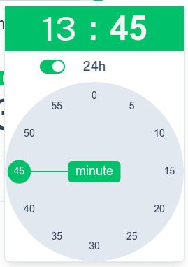

# Nuxt UI Timepicker

A beautiful time picker for Nuxt 3 apps using [Nuxt UI](https://ui.nuxt.com) and [Culori](https://culorijs.org).

## ✨ Features

This module consists of three nuxt-ui based components for getting a reusable TimePicker:

- `TimePicker.vue`: A button-icon with popup-based time picker with emitting and receiving an hourMinute object: {hour: number, minute: number}
- `InputTimePicker.vue`: Input field with time string in v-model (`HH:MM`)
- `ClockDial.vue`: Reusable clock dial canvas (used internally by TimePicker and InputTimePicker) - can be used for making your own version of a TimePicker
- culori is used to get the primary color from the nuxt-ui settings.
- Fully styled with Nuxt UI components
- Supports dark mode
- Made with ❤️ by [Paul Becue](mailto:paul.becue@gmail.com) at [BQ Systems](https://bqsystems.be) – Oostende, Belgium - [](https://github.com/paul908/nuxt-ui-timepicker)
- MIT licensed: [](LICENSE.md)

## Installation

### Create a new nuxt project

```bash
pnpm create nuxt <project-name>
```

### Install the module and extra dependencies

```bash
pnpm add @iconify-json/lucide @iconify-json/simple-icons @nuxt/kit culori @nuxt/ui nuxt-ui-timepicker 
```

### Add modules to nuxt.config.ts

```ts
modules: [
  '@nuxt/ui',
  'nuxt-ui-timepicker'
]
```

## Screenshots of playground and ClockDial.vue

### playground index.vue


### ClockDial.vue





## Source code and playground - on github.com

- Contains source code and a simple app that shows the usage of the TimePickers.
- [View on GitHub](https://github.com/paul908/nuxt-ui-timepicker)

## Inspired by a jquery plugin

I did a remake a MIT licensed jquery plugin, it inspired me for the visuals but I made the controller from zero in a vue/nuxt/nuxt-ui style: [Clock Timepicker Plugin for jQuery](https://github.com/loebi-ch/jquery-clock-timepicker)

## License

MIT licensed: [](LICENSE.md)

## Contributing

This module is made with nuxt-ui components, but not as part of @nuxt/ui. It is not made using tailwind-variants. But the ClockDial.vue part can be used for making your own version of a TimePicker using tailwind-variants and then be incorporated in @nuxt/ui. 

The timepicker can also be refactored to whatever tailwindcss based timepicker. It will be a joy for me to see parts of this code—especially ClockDial.vue—being reused in other timepickers! Be creative!

# About

## Project Info

Source code available on [GitHub](https://github.com/paul908/nuxt-ui-timepicker).

## Author

**Paul Becue**  
[BQ Systems](https://bqsystems.be) – Oostende, Belgium  
📧 [paul.becue@gmail.com](mailto:paul.becue@gmail.com)
